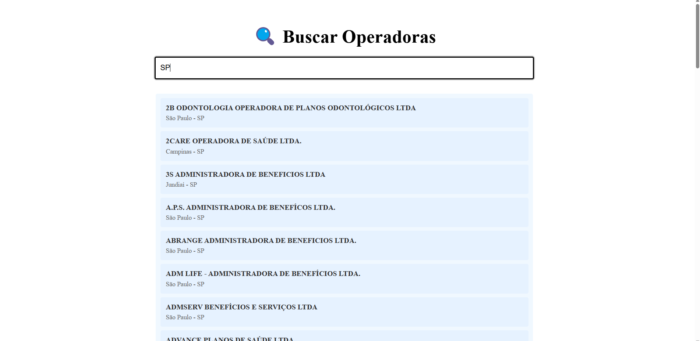
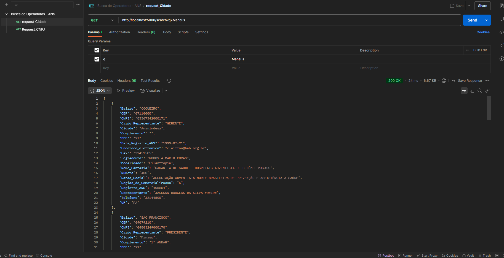
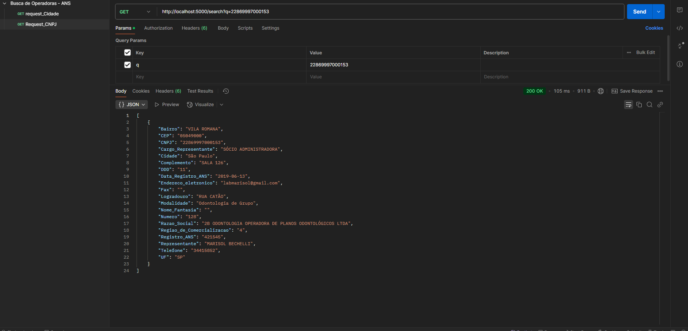

## Em português

# 🔍 Busca de Operadoras de plano de saude ativas

## ✨ O Que Este Projeto Faz?  

Imagine precisar encontrar uma operadora de plano de saúde em **Manaus** ou verificar quais estão registradas em **São Paulo**. Este sistema permite:  

- 🔎 **Buscar operadoras** por nome, cidade, UF, Razao_Social, Nome_Fantasia e CNPJ 
- 📱 **Interface simples** sem complicações  
- ⚡ **Resultados instantâneos** enquanto você digita  

**Exemplo de uso**:  
> *"Digite 'Manaus' para filtrar as operadodas da cidade de Manaus ou 'SP' para filtrar por São Paulo" *

---

## 🛠️ Como Funciona Nos Bastidores?  

### 🌐 **Parte 1: O Servidor (API)**  
*"Como um atendente virtual que consulta uma lista gigante"*  

- **Onde os dados ficam?** → Em arquivo seguro (`resources/Relatorio_cadop.csv`)  
- **Como a busca funciona?** → O servidor:  
  1. Recebe seu termo (ex: "Manaus")  
  2. Filtra 50 resultados mais relevantes  
  3. Retorna em segundos  

---

### 🖥️ **Parte 2: A Tela de Busca**  
*"Como um Google para operadoras de saúde"*  

- **O que você vê**:  
  - Uma barra de busca simples  
  - Resultados em cards organizados  
  - Mensagens claras se algo der errado  

- **Magia acontece quando**:  
  - Você digita → Sistema consulta a API → Mostra resultados  



---


### Para **Desenvolvedores**:  

1. **API** (Precisa do Python):  
   ```bash
   cd API
   pip install -r requirements.txt  # Instala as ferramentas
   python app.py  # Liga o servidor
   ```

2. **Tela Web** (Precisa do Node.js):  
   ```bash
   cd frontend
   npm install  # Baixa os componentes
   npm run dev  # Inicia o site
   ```
---
3. **Testes Com Postman**:  
   1. **Importe a coleção**:  
      `API/postman/BuscadeOperadoras-ANS.postman_collection.json`

   2. **Exemplos prontos**:
   - Busca por cidade:  
       
     *Exemplo: `?q=Manaus`*

   - Busca por CNPJ:  
       
     *Exemplo: `?q=22869997000153`*


## In English

# 🔍 Search for Active Health Plan Operators

## ✨ What Does This Project Do?

Imagine needing to find a health plan operator in **Manaus** or checking which ones are registered in **São Paulo**. This system allows:

- 🔎 **Search for operators** by name, city, state, social reason, trade name and CNPJ
- 📱 **Simple interface** without complications
- ⚡ **Instant results** while you type

**Usage Example**:  
> *"Type 'Manaus' to filter the operators in the city of Manaus or 'SP' to filter by São Paulo."*

---

## 🛠️ How It Works Behind the Scenes?

### 🌐 **Part 1: The Server (API)**  
*"Like a virtual attendant consulting a giant list."*

- **Where are the data stored?** → In a secure file (`resources/Relatorio_cadop.csv`)
- **How does the search work?** → The server:  
  1. Receives your term (e.g., "Manaus")
  2. Filters the 50 most relevant results
  3. Returns in seconds

---

### 🖥️ **Part 2: The Search Screen**  
*"Like Google for health operators."*

- **What you see**:  
  - A simple search bar  
  - Results in organized cards  
  - Clear messages if something goes wrong  

- **Magic happens when**:  
  - You type → System queries the API → Displays results  


---

### For **Developers**:

1. **API** (Requires Python):  
   ```bash
   cd API
   pip install -r requirements.txt  # Install the tools
   python app.py  # Start the server
   ```

2. **Web Screen** (Requires Node.js):  
   ```bash
   cd frontend
   npm install  # Download components
   npm run dev  # Start the site
   ```

---

3. **Testing with Postman**:  
   1. **Import the collection**:  
      `API/postman/BuscadeOperadoras-ANS.postman_collection.json`

   2. **Ready examples**:
   - Search by city:  
       
     *Example: `?q=Manaus`*

   - Search by CNPJ:  
       
     *Example: `?q=22869997000153`*
    
